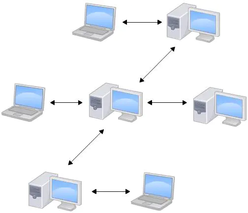

# Git常用命令
<br >


> git是目前世界上最先进的分布式版本控制系统, 它由Linux的创始人Linus在2005年创建, 创建之初, Linus是为了解决Linux系统的代码管理问题, 由于Linux是开源的, 全世界的热心志愿者都可以编写Linux代码, 但是代码版本管理维护越来越困难, 因此, git诞生了.

### 集中式vs分布式


集中式版本控制系统的版本库是存放在中央服务器的, 编写代码时, 需要先从中央服务器`checkout`代码到本地, 编写完成后, 再把代码从本地`push`到中央服务器, 集中式版本控制系统最大的毛病就是必须联网才能工作, 在网络较差的地方或者没有网络那就没办法工作了.



而分布式版本控制系统是不存在所谓"中央服务器" 的, 每个人的电脑都是一个完整的版本库.  其实,为了方便交换大家的修改, 分布式版本控制系统也有一个充当"中央服务器"的电脑.
集中式版本控制系统的代表是`SVN`, `CVS`等.
分布式版本控制系统的代表就是我们今天的主角`GIT`了.

### git安装
安装过程很简单, 到[官网下载](//git-scm.com/downloads)安装包, 双击安装就可以了(我的电脑是window, 因此这个安装包也仅考虑到window64位版本), 安装成功后, 在任意文件夹下右键可以看到`git Bash`表明安装成功了.
安装完成后, 右键打开`git bash`设置本台机器使用`git`时用户的名称和邮箱
```js
$ git config --global user.name "Your Name"
$ git config --global user.email "email@example.com"
```
这个操作仅需要设置一次

### 创建版本库
```js
# 在当前目录新建一个Git代码库
$ git init

# 新建一个目录，将其初始化为Git代码库
$ git init [project-name]

# 下载一个项目和它的整个代码历史
$ git clone [url]
```

### 配置
在项目目录下可以通过常见.gitignore文件来设置配置规则
+ 空格不匹配任意文件，可作为分隔符，可用反斜杠转义
+ 以“＃”开头的行都会被 Git 忽略。即#开头的文件标识注释，可以使用反斜杠进行转义。
+ 以斜杠"/"开头表示目录；"/"结束的模式只匹配文件夹以及在该文件夹路径下的内容，但是不匹配该文件；"/"开始的模式匹配项目跟目录；如果一个模式不包含斜杠，则它匹配相对于当前 .gitignore 文件路径的内容，如果该模式不在 .gitignore 文件中，则相对于项目根目录。
+ 以星号"*"通配多个字符，即匹配多个任意字符；使用两个星号"**" 表示匹配任意中间目录，比如`a/**/z`可以匹配 a/z, a/b/z 或 a/b/c/z等。
+ 以问号"?"通配单个字符，即匹配一个任意字符；
+ 以方括号"[]"包含单个字符的匹配列表，即匹配任何一个列在方括号中的字符。比如[abc]表示要么匹配一个a，要么匹配一个b，要么匹配一个c；如果在方括号中使用短划线分隔两个字符，表示所有在这两个字符范围内的都可以匹配。比如[0-9]表示匹配所有0到9的数字，[a-z]表示匹配任意的小写字母）。
+ 以叹号"!"表示不忽略(跟踪)匹配到的文件或目录，即要忽略指定模式以外的文件或目录，可以在模式前加上惊叹号（!）取反。需要特别注意的是：如果文件的父目录已经被前面的规则排除掉了，那么对这个文件用"!"规则是不起作用的。也就是说"!"开头的模式表示否定，该文件将会再次被包含，如果排除了该文件的父级目录，则使用"!"也不会再次被包含。可以使用反斜杠进行转义。
**需要谨记：git对于.ignore配置文件是按行从上到下进行规则匹配的，意味着如果前面的规则匹配的范围更大，则后面的规则将不会生效；**

| 实例 | 解释 |
| :----: | ---- |
| # | 表示此为注释,将被Git忽略 |
| *.a | 表示忽略所有 .a 结尾的文件 |
| !lib.a | 表示但lib.a除外 |
| /TODO | 表示仅仅忽略项目根目录下的 TODO 文件，不包括 subdir/TODO |
| build/ | 表示忽略 build/目录下的所有文件，过滤整个build文件夹 |
| doc/*.txt | 表示会忽略doc/notes.txt但不包括 doc/server/arch.txt |
| bin/ | 表示忽略当前路径下的bin文件夹，该文件夹下的所有内容都会被忽略，不忽略 bin 文件 |
| /bin | 表示忽略根目录下的bin文件 |
| debug/*.obj | 表示忽略debug/io.obj，不忽略 debug/common/io.obj和tools/debug/io.obj |
| **/foo |  表示忽略/foo,a/foo,a/b/foo等 |
| a/**/b | 表示忽略a/b, a/x/b,a/x/y/b等 |
| !/bin/run.sh | 表示不忽略bin目录下的run.sh文件 |
| *.log | 表示忽略所有 .log 文件 |
| config.php | 表示忽略当前路径的 config.php 文件 |
| /mtk/ | 表示过滤整个mtk文件夹 |
| *.zip | 表示过滤所有.zip文件 |

### git命令


名词解释: Workspace(工作区), Index/Stage(暂存区), Repository(仓库区), Remote(远程仓库)

1. 增加/删除文件
```js
# 添加指定文件到暂存区
$ git add [file1] [file2] ...

# 添加指定目录到暂存区，包括子目录
$ git add [dir]

# 添加当前目录的所有文件到暂存区
$ git add .

# 添加每个变化前，都会要求确认
# 对于同一个文件的多处变化，可以实现分次提交
$ git add -p

# 删除工作区文件，并且将这次删除放入暂存区
$ git rm [file1] [file2] ...

# 停止追踪指定文件，但该文件会保留在工作区
$ git rm --cached [file]

# 改名文件，并且将这个改名放入暂存区
$ git mv [file-original] [file-renamed]
```

2. 代码提交
```js
# 提交暂存区到仓库区
$ git commit -m [message]

# 提交暂存区的指定文件到仓库区
$ git commit [file1] [file2] ... -m [message]

# 提交工作区自上次commit之后的变化，直接到仓库区
$ git commit -a

# 提交时显示所有diff信息
$ git commit -v

# 使用一次新的commit，替代上一次提交
# 如果代码没有任何新变化，则用来改写上一次commit的提交信息
$ git commit --amend -m [message]

# 重做上一次commit，并包括指定文件的新变化
$ git commit --amend [file1] [file2] ...
```

3. 分支
```js
# 列出所有本地分支
$ git branch

# 列出所有远程分支
$ git branch -r

# 列出所有本地分支和远程分支
$ git branch -a

# 新建一个分支，但依然停留在当前分支
$ git branch [branch-name]

# 新建一个分支，并切换到该分支
$ git checkout -b [branch]

# 新建一个分支，指向指定commit
$ git branch [branch] [commit]

# 新建一个分支，与指定的远程分支建立追踪关系
$ git branch --track [branch] [remote-branch]

# 切换到指定分支，并更新工作区
$ git checkout [branch-name]

# 切换到上一个分支
$ git checkout -

# 建立追踪关系，在现有分支与指定的远程分支之间
$ git branch --set-upstream [branch] [remote-branch]

# 合并指定分支到当前分支
$ git merge [branch]

# 选择一个commit，合并进当前分支
$ git cherry-pick [commit]

# 删除分支
$ git branch -d [branch-name]

# 删除远程分支
$ git push origin --delete [branch-name]
$ git branch -dr [remote/branch]
```

4. 标签
```js
# 列出所有tag
$ git tag

# 新建一个tag在当前commit
$ git tag [tag]

# 新建一个tag在指定commit
$ git tag [tag] [commit]

# 删除本地tag
$ git tag -d [tag]

# 删除远程tag
$ git push origin :refs/tags/[tagName]

# 查看tag信息
$ git show [tag]

# 提交指定tag
$ git push [remote] [tag]

# 提交所有tag
$ git push [remote] --tags

# 新建一个分支，指向某个tag
$ git checkout -b [branch] [tag]
```

5. 查看信息
```js
# 显示有变更的文件
$ git status

# 显示当前分支的版本历史
$ git log

# 显示commit历史，以及每次commit发生变更的文件
$ git log --stat

# 搜索提交历史，根据关键词
$ git log -S [keyword]

# 显示某个commit之后的所有变动，每个commit占据一行
$ git log [tag] HEAD --pretty=format:%s

# 显示某个commit之后的所有变动，其"提交说明"必须符合搜索条件
$ git log [tag] HEAD --grep feature

# 显示某个文件的版本历史，包括文件改名
$ git log --follow [file]
$ git whatchanged [file]

# 显示指定文件相关的每一次diff
$ git log -p [file]

# 显示过去5次提交
$ git log -5 --pretty --oneline

# 显示所有提交过的用户，按提交次数排序
$ git shortlog -sn

# 显示指定文件是什么人在什么时间修改过
$ git blame [file]

# 显示暂存区和工作区的差异
$ git diff

# 显示暂存区和上一个commit的差异
$ git diff --cached [file]

# 显示工作区与当前分支最新commit之间的差异
$ git diff HEAD

# 显示两次提交之间的差异
$ git diff [first-branch]...[second-branch]

# 显示今天你写了多少行代码
$ git diff --shortstat "@{0 day ago}"

# 显示某次提交的元数据和内容变化
$ git show [commit]

# 显示某次提交发生变化的文件
$ git show --name-only [commit]

# 显示某次提交时，某个文件的内容
$ git show [commit]:[filename]

# 显示当前分支的最近几次提交
$ git reflog
```

6. 远程同步
```js
# 下载远程仓库的所有变动
$ git fetch [remote]

# 显示所有远程仓库
$ git remote -v

# 显示某个远程仓库的信息
$ git remote show [remote]

# 增加一个新的远程仓库，并命名
$ git remote add [shortname] [url]

# 取回远程仓库的变化，并与本地分支合并
$ git pull [remote] [branch]

# 上传本地指定分支到远程仓库
$ git push [remote] [branch]

# 强行推送当前分支到远程仓库，即使有冲突
$ git push [remote] --force

# 推送所有分支到远程仓库
$ git push [remote] --all
```

7. 撤销
```js
# 恢复暂存区的指定文件到工作区
$ git checkout [file]

# 恢复某个commit的指定文件到暂存区和工作区
$ git checkout [commit] [file]

# 恢复暂存区的所有文件到工作区
$ git checkout .

# 重置暂存区的指定文件，与上一次commit保持一致，但工作区不变
$ git reset [file]

# 重置暂存区与工作区，与上一次commit保持一致
$ git reset --hard

# 重置当前分支的指针为指定commit，同时重置暂存区，但工作区不变
$ git reset [commit]

# 重置当前分支的HEAD为指定commit，同时重置暂存区和工作区，与指定commit一致
$ git reset --hard [commit]

# 重置当前HEAD为指定commit，但保持暂存区和工作区不变
$ git reset --keep [commit]

# 新建一个commit，用来撤销指定commit
# 后者的所有变化都将被前者抵消，并且应用到当前分支
$ git revert [commit]

# 暂时将未提交的变化移除，稍后再移入
$ git stash
$ git stash pop
```

### 常见错误
1. 用户名或密码错误, 项目好好地突然报错, 原来是在gitee上重新设置了邮箱地址造成的
```js
$ git push origin master
remote: Incorrect username or password ( access token )
fatal: Authentication failed for 'https://gitee.com/gavin_d/xxxxxx.git/'
```
方法: 打开电脑的控制面板-> 用户账户 -> 管理windows凭证, 找到普通凭证中自己的帐号信息, 填入正确的用户名和密码保存即可

2. 404 Not Found , 修改了用户名后引发了很多问题
```js
ERROR: Repository not found.
fatal: Could not read from remote repository.

 Please make sure you have the correct access rights
 and the repository exists.
```
方法: 输入`git remote set-url origin git@gitee.com:xxxxxx/xxxxxx.git`, 你的新仓库地址

参考文献:
+ [常用 Git 命令清单](http://www.ruanyifeng.com/blog/2015/12/git-cheat-sheet.html)
+ [git忽略提交规则](https://www.cnblogs.com/kevingrace/p/5690241.html)
+ [git教程](https://www.liaoxuefeng.com/wiki/0013739516305929606dd18361248578c67b8067c8c017b000/)
