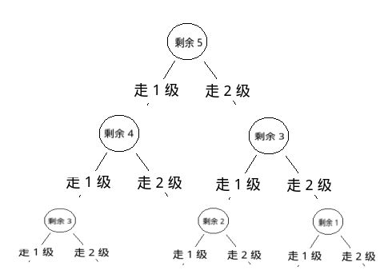

# 一道算法题

> 给定一个有 N 级台阶的楼梯，一个人从下到上开始上台阶，这个人有两种上台阶的方式：一次上一个台阶，一次上两个台阶；
> 问：从台阶底端走到到台阶顶端，有多少种上台阶的方式？

在一次面试过程中遇到了这样的一个题目，那时候首先想到的就是使用穷举法去算，结果得出了数学表达式却没有写出来代码:sweat_smile:。

只怪自己太菜了，回来 google 后才发现用穷举法如此简单：

```js
// @params step {number} 总共有step级台阶
// @return {number} 走法数
function moveNum(step) {
  if (step <= 0) {
    return 0
  } else if (step === 1) {
    return 1
  } else if (step === 2) {
    return 2
  }
  return moveNum(step - 1) + moveNum(step - 2)
}
```

上述代码还有可以优化的地方，看一下这个题的**二叉树**图：



可以发现，对于剩余3的情况，第三层最左边和第二层最右边都出现了，在上述代码中我们需要每次都计算相关的值，造成对性能的损耗。因此，我们可以把对应的值保存起来，下次再计算相同值时直接调用就可以了：

```js
let calculated = []

function moveNum(step) {
  if (step <= 0) {
    return 0
  } else if (step === 1) {
    return 1
  } else if (step === 2) {
    return 2
  }
  if (!calculated[step - 1]) {
    calculated[step - 1] = moveNum(step - 1) 
  }
  if (!calculated[step - 2]) {
    calculated[step - 2] = moveNum(step - 2) 
  }
  return calculated(step - 1) + calculated(step - 2)
}
```

首先创建一个空数组，它的作用是用来保存 moveNum 函数某个特定参数的结果。比如，我们在第一次计算的时候算出了 moveNum(3) 的结果是 3 ，并把相应的结果保存到 calculated 数组中，到第二次需要再次计算 moveNum(3) 时，由于保存在 calculated[3] 中的结果就是我们想要的，就可以直接在数组中取值，免去重复计算。

#### 斐波那契数列

在数学领域，这种算法叫斐波那契数列。


以斐波那契数列为边的正方形拼成的近似的黄金矩形（1：1.618）


#### 扩展

JS中，还有一些情况也可以使用递归的思想解决。递归的核心思想有两步：

- 写出递归公式；
- 找到终止条件。

1. 深拷贝

```js
function deepClone(obj) {
  if (typeof obj !== 'object') {
    return
  }
  let newObj = obj instanceof Array ? [] : {}
  for(let k in obj) {
    if (obj.hasOwnProperty(k)) {
      if (typeof obj[k] === 'object') {
        newObj[k] = deepClone(obj[k]) // 递归公式
      } else {
        newObj[k] = obj[k] // 终止条件
      }
    }
  }
  return newObj
}
```

2. 数组扁平化

如何把`[1, [2], [3, [4, [5]]]]`拍平得到`[1,2,3,4,5]`。如果确定数组是二位数组，可使用数组方法`arr.flat()`。

```js
function flatten(arr) {
  let newArr = []
  arr.forEach(item => {
    if (item instanceof Array) {
      newArr = newArr.concat(flatten(item)) // 递归公式
    } else {
      newArr.push(item) // 终止条件
    }
  })
  return newArr
}
```


<Vssue :title="$title"/>
