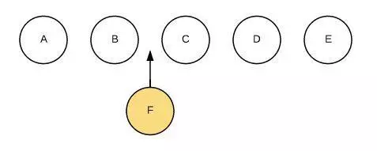

# Vue面试题
<br >

### 为什么使用v-for时要添加唯一的key?

是为了更高效的渲染DOM，我们都知道vue和react都是使用diff算法来实现dom的渲染和更新。

打个比方：我们需要在下图中插入一个F节点：


Diff算法默认执行起来会将后面的DOM全部进行替换，而如果我们使用key标记了节点之后就能高效的渲染出DOM，已有的节点则不需要重新渲染。


### computed和watch的区别是什么？

计算属性是基于他们的依赖进行缓存的，也就是说只有他们的依赖发生改变时才会重新求值。watch是一个监听的动作，用来观察和响应Vue实例上的数据变动。

computed主要用于对同步数据的处理，watch则主要用于观测某个值的变化去完成一段开销较大的复杂业务逻辑。

初始化的时候watch并不会执行，只有当它监听的数据改变时才会执行。可以设置immediate为ture来立即执行handler。要深入监听一个对象可设置deep为ture,但这样性能开销可能会比较大，如果只是监听对象的某个属性，可以使用字符串的方式。

### vue组件通信的方式有哪些？
1. props & $emit
2. $parent & $children
3. provide & inject
4. $refs
5. eventBus
6. vuex

详细讲一下事件总线（eventBus），它是通过新建一个vue实例对象，在发送事件的组件中通过eventBus.$emit向外传递一个自定义事件，然后在接收事件的组件的mounted中通过eventBus.$on接收传递过来的数据。假设有两个vue组件页面：A和B，A页面在按钮上面绑定了点击事件，发送一则消息，想通知B页面。
```js
// eventBus.js
import Vue from 'vue'
export const eventBus = new Vue()
```
```vue
<!-- A页面 -->
<template>
    <button @click="sendMsg()">-</button>
</template>

<script> 
import { eventBus } from "./eventBus"

export default {
  methods: {
    sendMsg() {
      EventBus.$emit("aMsg", '来自A页面的消息');
    }
  }
}; 
</script>
```
```vue
<!-- B页面 -->
<template>
  <p>{{msg}}</p>
</template>

<script> 
import { eventBus } from "./eventBus"

export default {
  data(){
    return {
      msg: ''
    }
  },
  mounted() {
    eventBus.$on("aMsg", this.acceptMsg())
  },
  methods: {
    acceptMsg(msg) {
      this.msg = msg
    }
  },
  beforeDestory() {
    // 组件销毁前移除自定义事件监听器
    eventBus.$off('aMsg')
  }
}
</script>
```

### 如何自定义v-model?
v-model的实现原理：
```vue
<input type="text" :value="name" @input="name = $event.target.value">
```
而自定义v-model指的是在组件上使用v-model，这里会用到一个model选项，它有prop和event两个参数，prop的值是表单元素绑定的值，event的值是表单元素emit事件的事件名称。
```vue
<!-- 父组件 -->
<template>
  <customInput v-model="inputVal"/>
</template>
<script>
import customInput from './components/customInput'

export default {
  name: 'App',
  data() {
    return {
      inputVal: 'xxx'
    }
  },
  components: {
    customInput
  }
}
</script>
```
```vue
<!-- customInput.vue -->
<template>
  <div>
    {{inputVal}}
    <input type="text" :value="inputVal" @input="$emit('changeHandler', $event.target.value)">
  </div>
</template>
<script>
export default {
  name: 'customInput',
  // 默认情况下，一个组件（当前父组件）上的v-model会把value用作prop且把input用作event
  model: {
    prop: 'inputVal',
    event: 'changeHandler'
  },
  props: {
    inputVal: String
  }
}
</script>
```

### vue相对于jquery的优劣?

+ DOM操作

vue基于MVVM思想，数据驱动，双向绑定，开发者只需要专注于代码逻辑的开发而不需要过多的关注DOM。jquery从它的api,如${}、find()等操作符可以看出，它的操作大多基于DOM，分散了开发者本该放在业务逻辑上的精力。

+ 代码结构

vue的代码结构更清晰，组件的html、js、css都写在一个文件中，后期再进行编译分离。jquery没有比较好的代码结构，一般还是由传统的页面组件。

+ 单页应用

vue通过hash或者history可实现单页应用，用户跳转不会出现白屏，体验更好。jquery还是传统的url跳转，用户体验不好。

+ 组件复用

vue可将相似的业务提取为组件来进行复用。jquery需依赖各种模板语法。

+ SEO

vue在浏览器中的渲染在不是SSR的情况下对SEO并不友好，因为它只是渲染一个基本的html文件，页面结构基本由js组成。jquery在合理使用标签的情况下相对SEO更友善。

+ 性能

vue采用虚拟DOM技术，不要用户频繁操作DOM，性能更好。


<Vssue :title="$title" />
