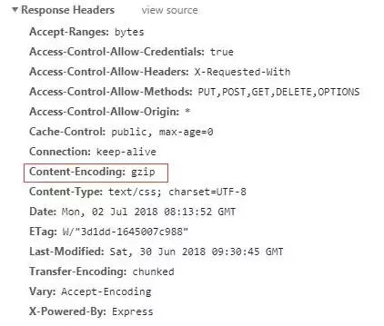
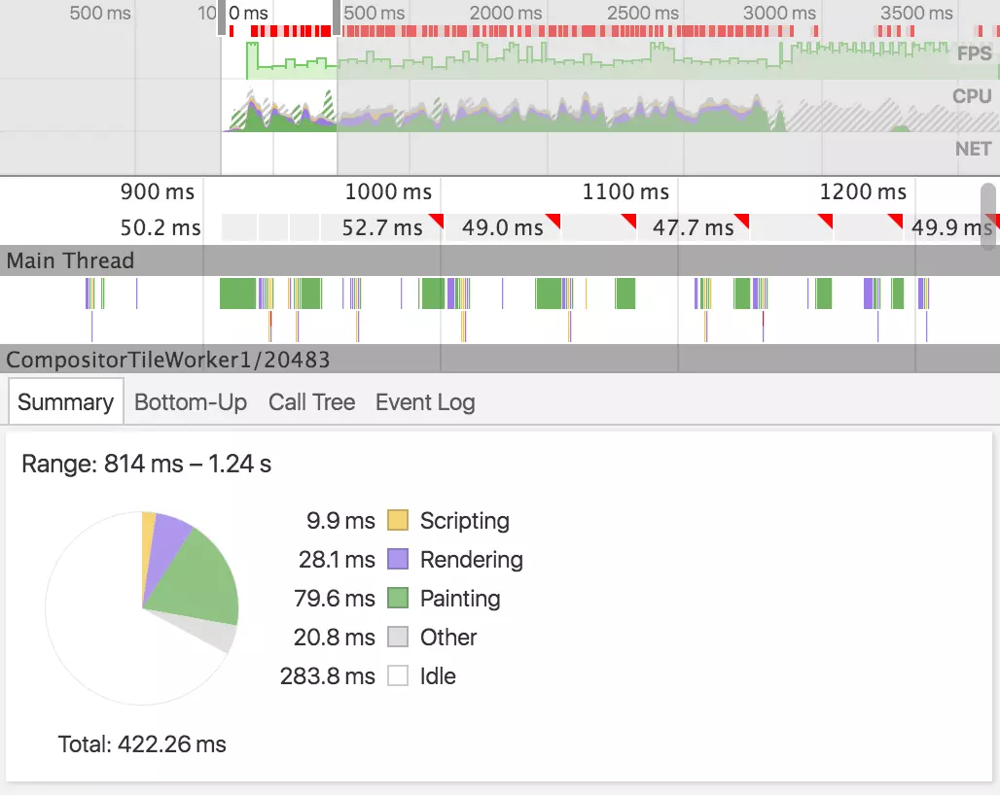
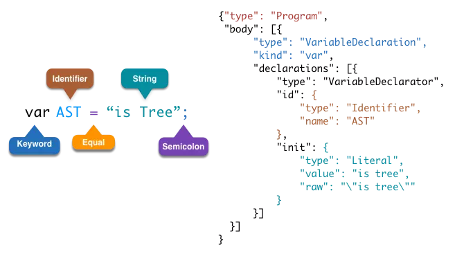
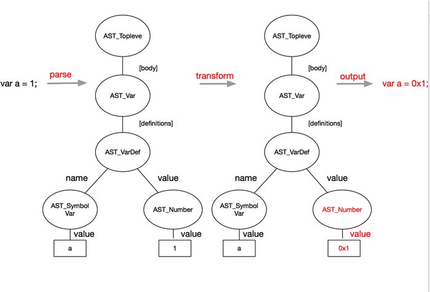

# Vue项目性能优化
<br >

> 本文转载自[我是你的超级英雄.掘金](https://juejin.im/post/5d548b83f265da03ab42471d#heading-2)，作者主要从3个方面提出了优化方案：Vue代码层面的优化；webpack配置层面的优化；web技术层面的优化。

### 代码层面的优化

+ **v-if和v-show区分使用场景**

+ **长列表性能优化**

Vue 会通过 Object.defineProperty 对数据进行劫持，来实现视图响应数据的变化，然而有些时候我们的组件就是纯粹的数据展示，不会有任何改变，我们就不需要 Vue 来劫持我们的数据，在大量数据展示的情况下，这能够很明显的减少组件初始化的时间，那如何禁止 Vue 劫持我们的数据呢？可以通过 Object.freeze 方法来冻结一个对象，一旦被冻结的对象就再也不能被修改了。
```js
export default {
  data() {
    return {
      users: {}
    }
  },
  async created() {
    const users = await axios.get("/api/users")
    this.users = Object.freeze(users)
  }
}
```

+ **事件销毁**

+ **图片资源懒加载**

对于图片过多的页面，为了加速页面加载速度，所以很多时候我们需要将页面内未出现在可视区域内的图片先不做加载， 等到滚动到可视区域后再去加载。这样对于页面加载性能上会有很大的提升，也提高了用户体验。我们在项目中使用 Vue 的 vue-lazyload 插件：
(1) 安装插件：
```js
npm install vue-lazyload --save-dev
```
(2) 在入口文件mian.js中引入并使用：
```js
import VueLazyload from 'vue-lazyload'

Vue.use(VueLazyload, {
preLoad: 1.3,
error: 'dist/error.png',
loading: 'dist/loading.gif',
attempt: 1
})
```
（3）在 vue 文件中将 img 标签的 src 属性直接改为 v-lazy ，从而将图片显示方式更改为懒加载显示：
```

```

+ **路由懒加载**

+ **第三方插件按需引入**

+ **优化无限列表性能**

如果你的应用存在非常长或者无限滚动的列表，那么需要采用 窗口化 的技术来优化性能，只需要渲染少部分区域的内容，减少重新渲染组件和创建 dom 节点的时间。 你可以参考开源项目  [vue-virtual-scroller](https://github.com/Akryum/vue-virtual-scroller)  来优化这种无限列表的场景的。

+ **SSR 或者 预渲染**

### Webpack 层面的优化

+ **Webpack 对图片进行压缩**

在 vue 项目中除了可以在 webpack.base.conf.js 中 url-loader 中设置 limit 大小来对图片处理，对小于 limit 的图片转化为 base64 格式，其余的不做操作。所以对有些较大的图片资源，在请求资源的时候，加载会很慢，我们可以用 image-webpack-loader来压缩图片：

（1）首先，安装 image-webpack-loader：
```js
npm install image-webpack-loader --save-dev
```
（2）然后，在 webpack.base.conf.js 中进行配置：
```js
{
  test: /\.(png|jpe?g|gif|svg)(\?.*)?$/,
  use:[
    {
    loader: 'url-loader',
    options: {
      limit: 10000,
      name: utils.assetsPath('img/[name].[hash:7].[ext]')
      }
    },
    {
      loader: 'image-webpack-loader',
      options: {
        bypassOnDebug: true,
      }
    }
  ]
}
```

+ **构建结果输出分析**

Webpack 输出的代码可读性非常差而且文件非常大，让我们非常头疼。为了更简单、直观地分析输出结果，社区中出现了许多可视化分析工具。这些工具以图形的方式将结果更直观地展示出来，让我们快速了解问题所在。接下来讲解我们在 Vue 项目中用到的分析工具：webpack-bundle-analyzer 。

我们在项目中 webpack.prod.conf.js 进行配置：
```js
if (config.build.bundleAnalyzerReport) {
  var BundleAnalyzerPlugin =   require('webpack-bundle-analyzer').BundleAnalyzerPlugin;
  webpackConfig.plugins.push(new BundleAnalyzerPlugin());
}
```
执行 $ npm run build --report 后生成分析报告。

### web技术层面的优化

+ **开启gzip压缩**

gzip 是 GNUzip 的缩写，最早用于 UNIX 系统的文件压缩。HTTP 协议上的 gzip 编码是一种用来改进 web 应用程序性能的技术，web 服务器和客户端（浏览器）必须共同支持 gzip。目前主流的浏览器，Chrome，firefox，IE等都支持该协议。常见的服务器如 Apache，Nginx，IIS 同样支持，gzip 压缩效率非常高，通常可以达到 70% 的压缩率，也就是说，如果你的网页有 30K，压缩之后就变成了 9K 左右

以下我们以服务端使用我们熟悉的 express 为例，开启 gzip 非常简单，相关步骤如下：

（1）安装：
```js
npm install compression --save
```
（2）添加代码逻辑：
```
var compression = require('compression');
var app = express();
app.use(compression())
```
（3）重启服务，观察网络面板里面的 response header，如果看到如下红圈里的字段则表明 gzip 开启成功 ：


+ **浏览器缓存**

参考[彻底理解浏览器的缓存机制](./彻底理解浏览器的缓存机制.md)

+ **CDN的使用**

+ **使用 Chrome Performance 查找性能瓶颈**

Chrome 的 Performance 面板可以录制一段时间内的 js 执行细节及时间。使用 Chrome 开发者工具分析页面性能的步骤如下。

（1） 打开 Chrome 开发者工具，切换到 Performance 面板
（2） 点击 Record 开始录制
（3） 刷新页面或展开某个节点
（4） 点击 Stop 停止录制



### webpack打包优化

webpack打包优化的核心是使用 `speed-measure-webpack-plugin` 插件，该插件能详细显示在项目打包过程中各个loader和插件的执行时长，从而针对性的进行优化，下面是官方给的图片：


使用它的方式非常简单，只需要在导出webpack配置时，为原始配置包一层smp.wrap即可。

```js
const SpeedMeasurePlugin = require('speed-measure-wepack-plugin')

const smp = new SpeedMeasurePlugin()

module.exports = smp.wrap(YourWebpackConfig)
```

大部分的执行时长一般消耗在编译JS、CSS的Loader以及对这两类代码执行压缩操作的Plugin上。这是因为，代码在进行编译和压缩的过程中，都需要执行这样一个流程：编译器（Webpack）需要将我们写下的字符串代码转化为AST（语法分析树），如下图：



显而易见，编译器肯定不能用正则去显式替换字符串来实现这样一个复杂的编译流程，而编译器需要做的就是遍历这棵树，找到正确的节点并替换成编译后的值，过程就像下图这样：



进入正题，说一说构建优化的主要四点：缓存、多核、抽离和拆分。

#### 缓存

在打包时，除了第一次，肯定不是所有的文件都有变动，但每次执行构建时却会把所有的文件都重复编译一遍。这样的重复工作可以像浏览器加载资源一样被缓存下来。大部分的Loader都提供了 cache 配置项。比如 babel-loader 中，可以设置 cacheDirectory 来开启缓存，这样， babel-loader 就会将每次的编译结果写进硬盘文件（默认是在项目根目录的 node_modules/.cache/babel-loader 中，当然也可以自定义）。

但如果 loader 不支持缓存呢？我们也有办法--- cache-loader。使用 loader 的方法很简单，就是把它写在代价高昂的 loader 最前面即可：

```js {6}
module.exports = {
  module: {
    rules: [
      {
        test: /\.ext$/,
        use: ['cache-loader', ...loaders],
        include: path.resolve('src'),
      },
    ],
  },
};
```

同理，对于构建流程造成效率瓶颈的代码压缩阶段，也可以通过缓存解决大部分问题，以 uglifyjs-webpack-plugin 为例：

```js {5}
module.exports = {
  optimization: {
    minimizer: [
      new UglifyJsPlugin({
        cache: true,
        parallel: true,
      }),
    ],
  },
};
```

#### 多核

多核的核心插件是 happypack。

```js
const HappyPack = require('happypack')
const os = require('os')
// 开辟一个线程池
// 拿到系统CPU的最大核数，happypack 将编译工作灌满所有线程
const happyThreadPool = HappyPack.ThreadPool({ size: os.cpus().length })

module.exports = {
  module: {
    rules: [
      {
        test: /\.(js|jsx)$/,
        exclude: /node_modules/,
        use: 'happypack/loader?id=js',
      },
    ],
  },
  plugins: [
    new HappyPack({
      id: 'js',
      threadPool: happyThreadPool,
      loaders: [
        {
          loader: 'babel-loader',
        },
      ],
    }),
  ],
}
```

所以配置起来逻辑其实很简单，就是用 happypack 提供的 Plugin 为你的 Loaders 做一层包装就好了，向外暴露一个id ，而在你的 module.rules 里，就不需要写loader了，直接引用这个 id 即可，所以赶紧用 happypack 对那些你测出来的代价比较昂贵的 loaders 们做一层多核编译的包装吧。

而对于一些编译代价昂贵的 webpack 插件，一般都会提供 parallel 这样的配置项供你开启多核编译，因此，只要你善于去它的官网发现，一定会有意想不到的收获噢～

#### 抽离

对于一些不常变更的静态依赖，比如vue、lodash等等，我们不希望这些依赖被集成进每一次构建逻辑中，因为它们真的太少时候会被变更了，所以每次的构建的输入输出都应该是相同的。因此，我们会设法将这些静态依赖从每一次的构建逻辑中抽离出去，以提升我们每次构建的构建效率。常见的方案有两种，一种是使用 webpack-dll-plugin 的方式，在首次构建时候就将这些静态依赖单独打包，后续只需要引用这个早就被打好的静态依赖包即可，有点类似“预编译”的概念；另一种，也是业内常见的 Externals 的方式，我们将这些不需要打包的静态资源从构建逻辑中剔除出去，而使用 CDN 的方式，去引用它们。而如果有靠谱的CDN，显然 Externals 方式更好。

#### 拆分

虽然说在大前端时代下，SPA 已经成为主流，但我们不免还是会有一些项目需要做成 MPA（多页应用），得益于 webpack 的多 entry 支持，因此我们可以把多页都放在一个 repo 下进行管理和维护。但随着项目的逐步深入和不断迭代，代码量必然会不断增大，有时候我们只是更改了一个 entry 下的文件，但是却要对所有 entry 执行一遍构建，因此，这里为大家介绍一个集群编译的概念：

什么是集群编译呢？这里的集群当然不是指我们的真实物理机，而是我们的 docker。其原理就是将单个 entry 剥离出来维护一个独立的构建流程，并在一个容器内执行，待构建完成后，将生成文件打进指定目录。为什么能这么做呢？因为我们知道，webpack 会将一个 entry 视为一个 chunk，并在最后生成文件时，将 chunk 单独生成一个文件。

因为如今团队在实践前端微服务，因此每一个子模块都被拆分成了一个单独的repo，因此我们的项目与生俱来就继承了集群编译的基因，但是如果把这些子项目以 entry 的形式打在一个 repo 中，也是一个很常见的情况，这时候，就需要进行拆分，集群编译便能发挥它的优势。因为团队里面不需要进行相关实践，因此这里笔者就不提供细节介绍了。

